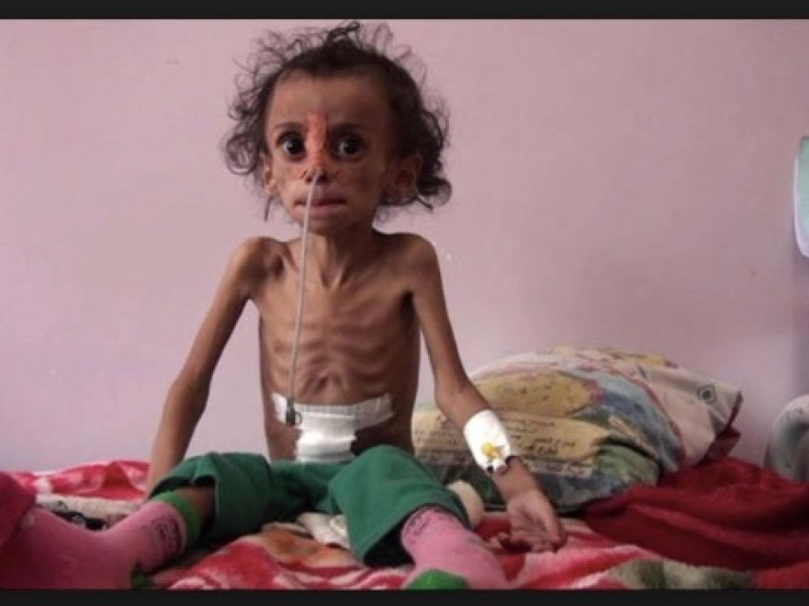
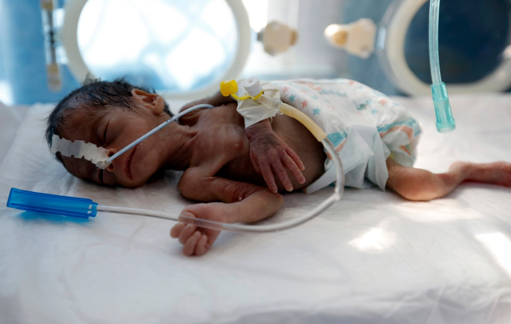
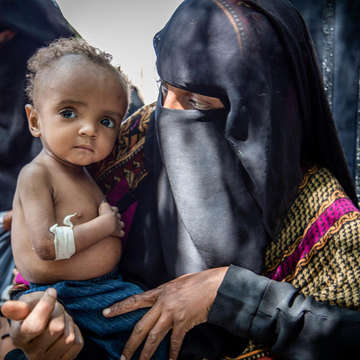
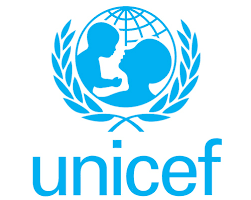
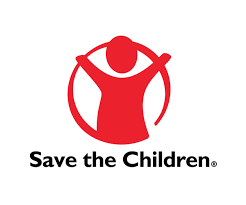
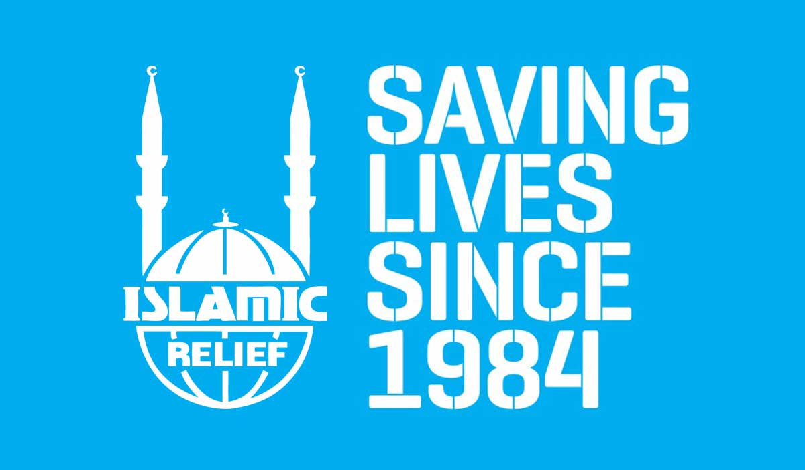

<!doctype html>
<html lang="en-US">

<head>
    <meta charset='utf-8'>
    <meta http-equiv='X-UA-Compatible' content='IE=edge'>
    <title>Yemen Crisis</title>
    <meta name='viewport' content='width=device-width, initial-scale=1'>
    <link rel='stylesheet' type='text/css' media='screen' href='docs/main.css'>
</head>

<body>
    <header>
        
SaveYemen

        
        <input type="checkbox" id="toggle-butt"/>

        <label for="toggle-butt" class="bread-crumbs">
            

            

            

        </label>

        <nav class="section-links">
            <ul class="home-links">
                <li>
                    <a href="index.html">Home</a>
                </li>
                <li>
                    <a href="index.html">About</a>
                </li>
                <li>
                    <a href="#donate-or-share">I want to help</a>
                </li>
            </ul>
        </nav>
    </header>
    
    <main>
        <section class = "screen-home-page">
            
            <section class="video-overlay">
                <section>
                    
Save a child today

                    <a href="#donate-sign">Learn how</a>
                </section>    
            </section>
            <video autoplay muted loop>
                <source src="video/videoplayback.mp4" type="video/mp4" />
                
                Your browser doesn't support video.
            </video>
        </section>
        
        <section class="grid-main-content">
            <section class="section-million">
                
                <article>
                    
Over

                    
1.5 million children

                    

                        Yemen is facing <strong>the worst</strong> and largest humanitarian crisis in the world. 
                        According to <a href="">unicef's</a> latest monthly situation report, approximately 1.71 million yemeni children 
                        are currently <strong>internally displaced</strong> whom are also impacted by the covid-19 crisis; which makes Yemen a living 
                        hell for them.
                    

                </article>
            </section>
            
            <section>
                <article>
                    
Over

                    
12 million children

                    12.2 million children are in dire need of humanitarian assistance who are living in hard-to-reac districts. 
                </article>
                
            </section>
            
            <section>
                
                <article>
                    
Over

                    
20 million people are in need.

                    

                        Unicef's lastest record shows 24.3 million people being in need of nutrition, health care, communication for development (C4D), and 
                        other essentials desperately needed for survival.
                        What's worse is that billions of pounds worth of weapons are being shipped from different countries to Saudi Arabia, one of the major influencers in the war!
                        It is time we lay a helping hand for all people in yemen.
                    

                </article>
            </section>
            
            <section class="question">
                
How can I help?

                <a href="#donate-sign">Donate to aid  or sign a petition to stop importation of weapons!</a>
            </section>
            
            <section>
                <article>
                    
                    
Appeal 2020

                    
<strong>US$ 535 million</strong>

                    

                        Here is how you and I can help achieve this (emoji pointing below.)
                    

                </article>
            </section>
            
            <section id="donate-sign">
                <section class="donate-section">
                    
Donate via these websites

                    <ul>
                        <li><a href="https://www.unicef.org/emergencies/yemen-crisis#what-unicef-is-doing">Unicef</a></li>
                        <li><a href="https://www.savethechildren.org/us/what-we-do/where-we-work/greater-middle-east-eurasia/yemen">savethechildren.org</a></li>
                        <li><a href="https://www.islamic-relief.org.uk/yemen-emergency-appeal/">islamic-relief.org.uk</a></li>
                    </ul>
                </section>
                
                <section class="or-section">
                    

                    
or

                    

                </section>
                
                <section class="share-sign">
                    
Sign a petition

                    <ul>
                        <li><a href="https://www.change.org/p/stop-the-war-and-end-the-famine-in-yemen">Stop the war and end famine in Yemen</a></li>
                        <li><a href="https://www.savethechildren.org.uk/how-you-can-help/show-your-support/campaigning-to-protect-children-in-yemen">Save the children (uk support)</a></li>
                    </ul>    
                </section>
            </section>

            <svg xmlns="http://www.w3.org/2000/svg" viewBox="0 0 1440 319"><path fill="#fff" fill-opacity="1" d="M0,224L80,192C160,160,320,96,480,96C640,96,800,160,960,170.7C1120,181,1280,139,1360,117.3L1440,96L1440,320L1360,320C1280,320,1120,320,960,320C800,320,640,320,480,320C320,320,160,320,80,320L0,320Z"></path></svg>
        </section>
        
    </main>
    
    <footer>
        
thank you :) love emoji

        
        
Copyright &copy; 2020 Fafowora Olasunkanmi

    </footer>
    
</body>

</html>